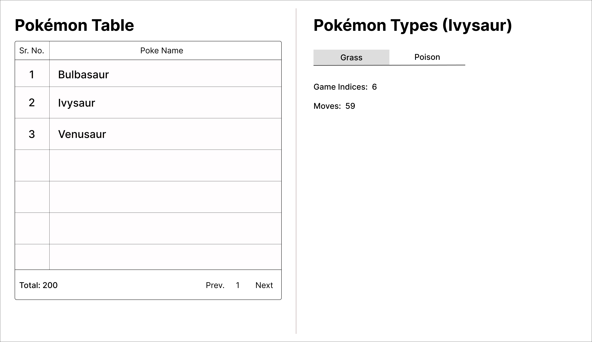

# Pokémon Data Explorer - Technical Assessment

## Overview

This technical assessment evaluates front-end development skills using Next.js, focusing on:
- API integration and data fetching
- Dynamic UI component creation
- State management
- Error handling
- Component reusability
- Clean code practices

## Tech Stack

- Next.js (App Router)
- React
- Tailwind CSS

## Getting Started

1. **Clone the repository**
   ```bash
   git clone [repository-url]
   cd Techstuff_Assessment_R-02
   ```

2. **Install dependencies**
   ```bash
   npm install
   ```

3. **Start development server**
   ```bash
   npm run dev
   ```
   The application will be available at `http://localhost:3000`

## Project Requirements

The project is structured into three progressive levels, each building upon the previous one.

### Level 1: Pokémon Table with Pagination

**Requirements:**
1. Create a table displaying Pokémon data from `https://pokeapi.co/api/v2/pokemon`
   - Columns: Sr. Number, Poke Name
   - Implement at `/poke` route using Next.js App Router

2. Pagination Implementation
   - Add Previous/Next navigation controls
   - Display total page count
   - Implement proper button states (disabled when appropriate)
   - Handle data fetching for page navigation

### Level 2: Interactive Pokémon Details

**Requirements:**
1. Clickable Pokémon Names
   - Fetch and display detailed information on click
   - Show Pokémon types as tabs on the right side

2. Type-Specific Information
   - Display relevant data under each type tab:
     - Game Indices count
     - Total moves count
   - Implement smooth tab switching with data updates

### Level 3: Enhanced User Experience

**Requirements:**
1. Error Handling
   - Implement comprehensive error handling for API calls
   - Display user-friendly error messages
   - Handle edge cases gracefully

2. Loading States
   - Add loading indicators during data fetching
   - Ensure smooth transitions between states

## Project Layout

The wireframe below represents the basic layout structure. You have creative freedom for the final design implementation.



## Development Guidelines

1. **Code Quality**
   - Follow React best practices
   - Break down components logically
   - Implement effective prop and state management
   - Write clean, maintainable code

2. **Git Practices**
   - Maintain a clean and meaningful commit history
   - Write descriptive commit messages
   - Your git history will be reviewed to understand your development process

## Important Notes

1. **Time Management**
   - Take sufficient time to demonstrate best practices
   - Focus on code quality and architecture
   - Don't rush the implementation

2. **Allowed Resources**
   - ✅ Google search
   - ✅ Third-party UI libraries
   - ✅ NPM packages for functionality

3. **Restrictions**
   - ❌ AI tools (ChatGPT, GitHub Copilot, etc.)
   - Note: Submissions will be verified using zerogpt.com
   - AI usage will lead to disqualification

## Evaluation Criteria

1. **Functionality**
   - Completion of all three levels
   - Accurate API integration
   - Proper error handling

2. **Code Quality**
   - Component reusability
   - Code organization
   - Best practices implementation

3. **Development Process**
   - Git commit history
   - Problem-solving approach
   - Code structure decisions

## Submission

1. Ensure all features are working as expected
2. Verify your git history is clean and meaningful
3. Make sure the code runs without any errors
4. Double-check the implementation against all requirements

---

Good luck with your assessment! If you have any questions, please reach out to the hiring team.